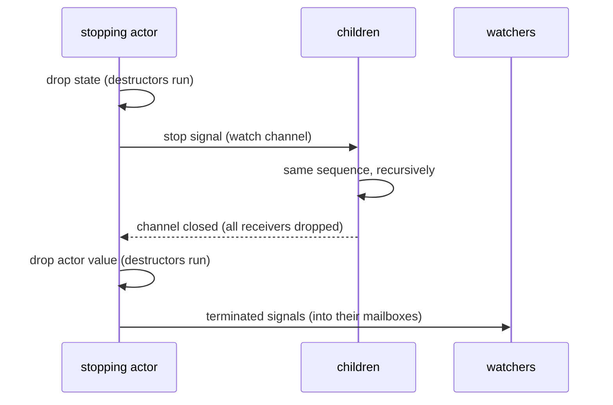

# Actors

This document explains how the tellus core works, from the public API down to the run loop:
defining actors, the actor tree, messaging, supervision and death watch. The implementation lives
in [`tellus/src`](../tellus/src). For a user-level summary see the [README](../tellus/README.md);
for event-sourced actors, which build on everything here, see [persistence.md](persistence.md).

## Overview

An actor is an independent unit of state processing one incoming message or signal at a time.
Message handling is typed and synchronous: `receive` of the [`Actor`](../tellus/src/actor.rs)
trait is a plain function from the current state and the incoming message to the next state, with
no future allocated or polled per message. Messaging via
[`ActorRef::tell`](../tellus/src/actor_ref.rs) is fire-and-forget and at-most-once, with
undeliverable messages dropped and logged as dead letters. Request-response builds on that
delivery: [`ActorRef::ask`](../tellus/src/request_response.rs) awaits a reply from outside the
actor tree and [`ActorContext::reply_to`](../tellus/src/request_response.rs) lets actors reply to
each other through their ordinary mailboxes.

Actors form a tree: an [`ActorSystem`](../tellus/src/actor_system.rs) spawns the root actor and
any actor spawns children via [`ActorContext::spawn`](../tellus/src/actor_context.rs); stopping an
actor stops its whole subtree, children first. An actor failing with an error or a panic is
stopped or restarted according to its [`SupervisionStrategy`](../tellus/src/actor_config.rs).

Death watch comes with an ordering guarantee: a terminated signal arrives behind all messages the
terminated actor has delivered to the watcher, so receiving it proves the watcher has seen every
message from that actor it will ever see.

Each actor runs as one Tokio task and owns a mailbox, unbounded by default.

## A first example

Condensed from [`examples/hello.rs`](../tellus/examples/hello.rs), a root actor which greets for
the one message it receives and then stops:

```rust
let system = ActorSystem::new(Greeter);
system.root().tell(Greet("Tellus".to_string()));
system.terminated().await?;
```

```rust
impl Actor for Greeter {
    type Message = Greet;
    type State = ();
    type Error = Infallible;

    fn init(&self, _: &ActorContext<Self::Message>) -> Result<Self::State, Self::Error> {
        Ok(())
    }

    fn receive(
        &self,
        _: &ActorContext<Self::Message>,
        incoming: Incoming<Self::Message>,
        _: Self::State,
    ) -> Result<Control<Self::State>, Self::Error> {
        if let Incoming::Message(Greet(name)) = incoming {
            println!("Hello, {name}!");
        }
        Ok(Control::Stop)
    }
}
```

For a larger example see [`examples/scatter_gather.rs`](../tellus/examples/scatter_gather.rs),
where a root actor scatters a workload across watched workers and uses the ordering guarantee to
know when all partial results are in.

## Defining an actor

The [`Actor`](../tellus/src/actor.rs) trait separates the actor value from its state:

- `Message` is the type of the received messages; actors which react to nothing use the
  uninhabited `Nothing`.
- `State` is rebuilt on every restart, while the actor value itself survives; stateless actors use
  `()`.
- `Error` is the failure type of `init` and `receive`; infallible actors use `Infallible`.

`init` creates the initial state and may already spawn children or send messages. `receive` takes
the state by value and returns [`Control`](../tellus/src/actor.rs): `Continue(next_state)`
designates the state handling the next message, `Stop` stops the actor. This makes an actor a
state machine over owned values, with no interior mutability required.

[`Incoming`](../tellus/src/actor.rs) is either `Message(M)` or the `Terminated(ActorId)` signal
for a watched actor. Handling both through one `receive` keeps signals ordered relative to
messages (see death watch below).

`receive` is synchronous, so it occupies a Tokio worker for its whole duration. An actor cannot be
stopped while `receive` runs, so a `receive` which never completes keeps all ancestors from
terminating. For long running or blocking work, spawn a task and send its result back via `tell`.

## The actor tree

[`ActorSystem::new`](../tellus/src/actor_system.rs) spawns the root actor and
[`ActorContext::spawn`](../tellus/src/actor_context.rs) (available in `init` and `receive`) spawns
children, so every actor has a parent and the whole application forms a tree. Spawning returns the
child's `ActorRef` immediately; `init` runs inside the child's own task, and messages told before
it completes are queued in the mailbox.

Termination is bottom-up: a stopping actor first stops its children, each of which recursively
does the same, and only terminates itself once all descendants have. `ActorSystem::terminated`
resolves once the root, and therefore the entire tree, has terminated.

## Configuration

[`ActorConfig`](../tellus/src/actor_config.rs) is passed via `spawn_with_config` or
`ActorSystem::with_config`:

| Field                  | Default     | Meaning                                                                       |
| ---------------------- | ----------- | ----------------------------------------------------------------------------- |
| `mailbox_capacity`     | `Unbounded` | Mailbox capacity; excess messages become dead letters                          |
| `supervision_strategy` | `Stop`      | What happens when the actor fails: `Stop` or `Restart` with a `RestartPolicy`  |

An unbounded mailbox never drops messages, but an actor which cannot keep up grows it without
limit. A bounded mailbox applies no backpressure: sends to a full mailbox fail as dead letters,
while terminated signals are still delivered.

The `serde` feature makes the whole configuration deserializable, so it can come from a config
file. The invariants it carries, `0 < min` and `min <= max` on the backoff bounds, live in
[`Backoff`](../tellus/src/backoff.rs): its fields are private and its constructor is fallible, and
deserialization is routed through that constructor via `#[serde(try_from = "...")]`. Every
container can therefore be plain public data, since no reachable `Backoff` value is invalid. A
zero minimum is rejected because it would make every step zero. The restart loop awaits the delay,
so a zero delay would let a failing `init` spin through its whole restart limit without ever
yielding.

## References and identity

An [`ActorRef`](../tellus/src/actor_ref.rs) pairs an [`ActorId`](../tellus/src/actor_id.rs) (a
UUID v7, so IDs are unique and time-ordered) with a sender, and is cheap to clone and share.
`tell` never blocks: if the actor has terminated or a bounded mailbox is full, the message is
dropped and logged as a dead letter with the actor ID and message type. Even a delivered message
may go unprocessed if the actor stops first: delivery is at-most-once, end to end.

Internally the sender is the mailbox's sending half; with the `cluster` feature it can instead be a
remote sink forwarding to an actor on another node (see the `tellus::cluster` module docs), which
also makes `ActorRef` serializable. The reference an actor gets for itself via
`ActorContext::self_ref` pairs it with the mailbox's sending half (`SelfRef` in
[`actor_ref.rs`](../tellus/src/actor_ref.rs)), which the watch mechanics below rely on.

## Request-response

Request-response is built on top of `tell`-style delivery, not beside it. A request message
carries a [`ReplyTo`](../tellus/src/request_response.rs), a single-shot destination for the reply:
the responder calls `reply` exactly once, enforced by consumption, and cannot tell how the
`ReplyTo` was created. Both creators erase their delivery mechanism behind it, so further delivery
mechanisms can be added without changing the API.

[`ActorRef::ask`](../tellus/src/request_response.rs) is the boundary API, for code outside of any
actor: `main`, tests, HTTP handlers, spawned tasks. The given function builds the request around a
oneshot-backed `ReplyTo`, the request is sent like a tell, and the returned future resolves with
the reply. Since the caller is awaiting, failures are returned instead of only logged.
`AskError::MailboxFull` or `AskError::ActorTerminated` are returned if the request cannot be sent,
with the `cluster` feature also `AskError::NotEncodable`, `AskError::TooLarge` or
`AskError::EndpointNotStarted`. `AskError::NoReply` is returned once it is detected that no reply
can arrive anymore, i.e. when the `ReplyTo` was dropped without a reply or the actor stopped with
the request still queued. That detection is best-effort, which is why every ask carries a timeout.
`AskError::Timeout` resolves the future once the given duration has elapsed without a reply, e.g.
against a responder which keeps the `ReplyTo` alive without replying. A late reply is dropped as a
dead letter.

[`ActorContext::reply_to`](../tellus/src/request_response.rs) is the actor side: it creates a
`ReplyTo` which delivers the reply into this actor's own mailbox, converted into its message type
by the given function, typically an enum variant constructor. No future is created or awaited; the
reply arrives through `receive` like any other message, in the normal mailbox FIFO. It takes the
same path as a tell to this actor: it counts against a bounded capacity and becomes a dead letter
if the asker has terminated or its mailbox is full.

Supervision composes with the retained mailbox: a request queued behind a failing message survives
a restart and is answered by the restarted state, while a request consumed by the failing
`receive` itself is not redelivered and hence resolves as `NoReply`.

With the `cluster` feature a `ReplyTo` is serializable and travels inside messages to other nodes,
so both `ask` and `reply_to` work against remote actors through the same API. It then also names
the actor the reply is delivered to, if one awaits it, which keeps a remote reply ordered with
that actor's other messages. [cluster.md](cluster.md) spells out which parts of this contract
carry over the wire and where the `NoReply` detection weakens further.

## Mailboxes

A mailbox ([`mailbox.rs`](../tellus/src/mailbox.rs)) is a FIFO channel of `Incoming<M>` split
into a `MailboxHandle` (the sending half, cloned into every `ActorRef`) and a `Mailbox` (the
receiving half, owned by the actor's run loop). Messages from one sender are received in the order
they were sent.

The underlying channel is always unbounded; a bounded mailbox is enforced by a lock-free
reservation counter ([`quota.rs`](../tellus/src/quota.rs)) in front of it: a message reserves
capacity before it is enqueued and releases it when it is received. This split is deliberate:
terminated signals and capacity answer different needs, so a terminated signal enqueues into the
same FIFO channel (preserving order behind queued messages) but bypasses the capacity check, since
a terminated signal must never be dropped.

The mailbox also owns watcher registration ([`watch.rs`](../tellus/src/watch.rs)): watchers are
collected in a map keyed by watcher ID which termination takes and closes atomically, so a watcher
racing with termination either registers in time and is signaled, or fails registration and learns
immediately that the actor has terminated. Either way no watcher is lost. Registration is O(1) and
two-sided: watching twice registers once as a property of the map, and each watching actor records
what it watches, so `unwatch` and the watcher's own termination deregister it. Dead watchers hence
never accumulate.

## The run loop

`spawn` in [`actor_context.rs`](../tellus/src/actor_context.rs), reached via
`ActorContext::spawn_with_config` and by `spawn_root`, spawns one Tokio task per actor;
event-sourced actors enter the same loop through
[`persistence/spawn.rs`](../tellus/src/persistence/spawn.rs), described in
[persistence.md](persistence.md):

1. Run `init`; a failure is fed to supervision just like a failure of `receive`, so under
   `Restart` even the first initialization is retried.
2. Loop: wait (biased) for either the parent's stop signal or the next incoming from the mailbox,
   and pass the incoming to `receive`.
3. Map the result to an outcome: `Continue` carries the next state, an error or panic consults the
   `SupervisionStrategy` (`Restart` or `Stop`), `Control::Stop` stops.
4. On stop, run the termination sequence below.

Both `init` and `receive` run under `catch_unwind`, so a panic is handled exactly like a returned
error: logged with the actor ID and fed to supervision. An error is logged with its source as a
separate field, so a wrapped cause stays queryable instead of being flattened into the message.
The biased select ensures a stop signal is honored before further queued messages once the parent
is stopping.

## Stopping and termination

Every actor owns a Tokio watch channel; its children hold receiver clones and every child task
selects on it (the "parent stopping" branch of the run loop). The termination sequence, in
`terminate` and `stop_children` in [`actor_context.rs`](../tellus/src/actor_context.rs):



The state goes first: it is consumed by the `receive` which decided to stop, or dropped right
where the parent's stop signal is received, in both cases before the children are stopped. A
resource an actor keeps in its state is hence gone while its children may still be running; what
outlives the whole subtree belongs in the actor value.

The closed channel is the completion barrier: a child drops its receiver clone only when its task
ends, so the channel closing proves every child has terminated. Only then does the actor drop its
own value and finally signal its watchers: a terminated signal must prove that the actor's
destructors have run.

The mailbox is drained and disconnected right at the start of the sequence: senders observe the
termination while the children still stop, and the destructors of the drained messages run as part
of it, so e.g. a queued request's reply channel resolves its ask as `NoReply` instead of pending
forever. A send racing with the drain can still slip past it; such a message is retained until its
last sender is dropped, which is why the `NoReply` detection is best-effort.

The root actor has no parent, so `ActorSystem::stop` is that channel from the outside: it sends on
the very sender which keeps the root alive, shared between the system and the root's watcher
registry. Dropping a system therefore still stops nothing, since the registry holds the other
reference. The root stops where it would stop for a parent, between messages and never inside
one: the message it is handling is finished first and, for an event sourced actor, so is its
settlement, so a shutdown can lose the acknowledgement of an event but never the event. Await
`ActorSystem::terminated` for the tree to be gone. Without it a root actor needs a message of its
own for shutdown, which an actor whose message type is not its own to choose, such as a `Host`,
cannot have.

## Supervision and restarts

[`SupervisionStrategy`](../tellus/src/actor_config.rs) decides what happens when `init` or
`receive` fails: `Stop` (the default) runs the termination sequence, `Restart` rebuilds the
actor's state, limited and paced by its `RestartPolicy`.

A restart stops the children (they belong to the failed state), waits for the backoff delay, then
re-runs `init` on the same actor value: anything the actor value itself carries survives, only the
state is rebuilt. The mailbox is retained, so messages queued behind the failing one are processed
by the restarted state and keep queuing during the backoff; the failing message itself is consumed
and not redelivered. Before restarting, the loop probes whether the parent has meanwhile started
stopping and stops instead; the parent stopping also interrupts a backoff delay in progress.

Failures are counted consecutively: the n-th restart is delayed by `backoff.min() * 2^(n-1)`
([`backoff.rs`](../tellus/src/backoff.rs)), capped at `backoff.max()`; once `max_restarts`
consecutive restarts have failed, the actor stops, which is how a persistent failure escalates to
the watchers. The count and the backoff reset once the actor has run for at least `reset_after`
without failing. Failures of `init` are counted too, including the first initialization at spawn,
so a failing initializer, e.g. one connecting to a struggling dependency, is retried with backoff
instead of looping hot.

Watches survive a restart: the restarted state can receive terminated signals for actors the
previous incarnation watched, including its own stopped children if it watched them.

## Death watch

`ActorContext::watch(other)` registers this actor as a watcher of `other`; once `other` has
terminated, this actor receives `Incoming::Terminated(other.actor_id())`. If `other` has already
terminated, registration fails and the signal is delivered right away, so watching is race-free.

`ActorContext::unwatch(other)` reverts a watch with a strong contract: after it returns, no
terminated signal for `other` is received, even if `other` has already terminated and the signal
is already enqueued. This is enforced on the watcher's side: the run loop delivers a terminated
signal only if its sender is still watched, consuming the watch, so a stale signal is dropped
before `receive` ever sees it. The same watcher-side bookkeeping deregisters a terminating actor
from everything it still watches.

With the `cluster` feature an actor on another node can be watched the same way; a synthesized
signal for a downed node then carries a weaker contract, spelled out in
[cluster.md](cluster.md).

A watcher (in [`watch.rs`](../tellus/src/watch.rs)) is essentially a sending handle into the
watching actor's own mailbox, handed to the watched actor. At termination, after its destructors
have run, the watched actor sends the terminated signal through it: into the same FIFO channel as
all the messages it delivered to the watcher before, which is the entire mechanism behind the
ordering guarantee. No coordination is needed beyond the shared queue.

At-most-once delivery bounds what the signal can prove: a message dropped as a dead letter, e.g.
told to a full bounded mailbox, never entered the queue. Receiving the signal hence proves that
the watcher has seen every message from the terminated actor it will ever see: each arrived before
the signal or was dropped as a dead letter.

## Hosts

A `Host` hosts entities: actors identified by a key, spawned on the first message for that key
and, if configured, passivated once nothing has messaged them for a while. Its own messages are
`HostEnvelope { key, message }`, so a host is spawned like any other actor and its entities are
addressed through `tell` and `ask` with an envelope. The entities are its children, hence stopping
it stops them first.

The host is given two functions. `spawn` must spawn a fresh child through the context it is
handed, on every call, e.g. via `ActorContext::spawn` or `ActorContext::spawn_event_sourced`; it
must not return an actor it has returned before, nor one from outside the host's subtree. One
entity per key, stopping the entities with the host and the delivery of buffered messages all rest
on that, and the signature cannot enforce it. `passivate` builds the message asking an entity to
stop, since an actor is stopped by itself or by its parent alone; an entity which does not stop on
that message is never passivated.

Passivation is what makes a host more than a map of references: it frees the memory of entities
nobody talks to. That is safe only where the entity's state is recoverable or disposable, which is
the case for event sourced entities, whose next incarnation replays what the store holds.

Since `receive` is synchronous and tellus has no scheduler, the host cannot wake itself on a
timer, and its own message type is reserved for its entities. It therefore spawns a ticker child
per period, an actor which stops itself once the idle timeout has elapsed: the terminated signal
of that child is the sweep. The ticker holds its sleeping task in a guard which aborts it when the
ticker stops, since terminating an actor does not cancel the tasks it spawned.

A sweep asks every entity idle for at least the timeout to stop, and only an entity whose mailbox
accepted that message counts as stopping; a full mailbox leaves it live and eligible at the next
sweep, so a passivate message is never silently lost. An entity which has not stopped by the
following sweep is logged at debug level as pending, without any claim about why: it may be
finishing a long command, a recovery or a persistence settlement before it reaches the queued
message.

While an entity stops, messages for it are buffered rather than sent, since the stopping
incarnation would process them only by accident. On its terminated signal the host spawns the
replacement, delivers the buffer in order and only then takes its next message, so one sender's
order holds across a passivation. The buffer is bounded; beyond it the newest message is refused
and logged as a dead letter, the way a full mailbox refuses one. The delivery of the buffer forces
a reservation past the entity's mailbox capacity rather than bypassing the quota, so a mailbox
smaller than the buffer loses nothing the host accepted and the count stays balanced: the
receiver releases every forced item like any other, and ordinary senders are refused until it has
drained back under its capacity.

An entity which stops on its own, e.g. under `SupervisionStrategy::Stop` after a failure, is
forgotten on its terminated signal and spawned afresh by the next message for its key.

Ownership across nodes is not part of this. A host is local: it is the single node half of the
sharded regions the roadmap describes, where the owner of a key is computed from the member list
rather than being wherever the message happened to arrive.

## Resolving `ActorSystem::terminated`

`spawn_root` in [`actor_system.rs`](../tellus/src/actor_system.rs) spawns the root actor through
the same `spawn` path as any child and registers a watcher directly in the root's watcher
registry. The watcher's handler resolves the oneshot behind `terminated()` and also owns the
sender of the root's stop channel, so the root keeps running exactly until its own termination has
signaled the watchers and drops them. If the root has already terminated when the watcher is
registered, registration fails and the oneshot is resolved right away, mirroring the race-free
watch registration. Dropping the `ActorSystem` without awaiting it does not stop the tree; the
root stops on its own terms.

## Panicking destructors

Every drop path the framework controls runs under `catch_unwind` (`drop_containing_panic` in
[`actor_context.rs`](../tellus/src/actor_context.rs)): the state dropped when the parent stops the
actor, and the actor value and the mailbox dropped at termination. A destructor panic is hence
logged and termination completes, including the signals to the watchers. A destructor panic on a
normal return of
`receive` is equally contained: when `receive` returns an error and the state's destructor panics
while the frame returns, that panic is caught like any other and fed to supervision. The locks the
framework holds itself recover from poisoning ([`sync.rs`](../tellus/src/sync.rs)), so a panic
contained by supervision cannot disable the watcher registry.

The one case out of reach is a panic during a panic: `init` or `receive` panics, and while that
panic unwinds, the destructor of a value still alive in the frame (the state, the message, a
local) panics as well. Rust aborts the process on a panic during unwinding, below `catch_unwind`
and hence below supervision. This is inherent to Rust, not specific to tellus: keep destructors
panic-free.

## Guarantees and limitations

- `tell` is fire-and-forget and at-most-once: no acknowledgements, no redelivery, dead letters are
  logged, not returned.
- Messages from one sender arrive in send order; terminated signals are ordered behind the watched
  actor's delivered messages and prove its destructors have run.
- `receive` is synchronous and cannot await; long running or blocking work belongs in a spawned
  task reporting back via `tell`.
- Request-response is at-most-once too: `ask` resolves exactly once, with the reply or an error,
  at the latest when its timeout elapses, and never redelivers; a `reply_to` reply is an ordinary
  send, dropped as a dead letter if the asker is gone or its bounded mailbox is full.
- A host has at most one incarnation of an entity at any time: a replacement is spawned only once
  the previous one's terminated signal has arrived.
- A message for an entity which is stopping is enqueued to its next incarnation, in order, up to
  the configured buffer, whatever that entity's mailbox capacity; beyond the buffer the newest is
  refused and logged as a dead letter. Enqueued is the whole promise: whether the incarnation
  processes the message depends on it initialising, or recovering, and on it not stopping first,
  exactly as for any `tell`.
- An entity is asked to passivate only once it has been idle for at least the configured timeout,
  and a host checks that about once per timeout. There is no upper bound on when the entity has
  stopped: the host's own mailbox, scheduling, the entity finishing the command it is on and, for
  an event sourced entity, its settlement all come first. An entity which does not stop on its
  passivate message is never passivated, and messages for it queue in the host's buffer until it
  does.
- These guarantees are stated for actors in one process; [cluster.md](cluster.md) spells out how
  they extend to actors on other nodes and where they weaken.
